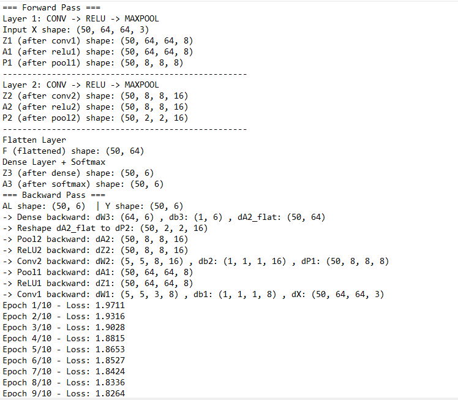
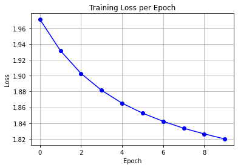

# Sign Language Digit Classifier – CNN from Scratch (NumPy)
This project demonstrates a complete handcrafted **Convolutional Neural Network (CNN)** built **from scratch using only NumPy**, designed to classify **sign language digits (0–5)** from RGB images (64×64×3).  
The implementation covers the full deep learning pipeline: **forward pass**, **backward pass**, **training**, **inference**, and **evaluation** — without using any high-level frameworks like TensorFlow or PyTorch.


<h3 align="center">Convolutional Neural Network Built From Scratch Using Just NumPy</h3>
<p align="center">
  
</p>

> A perfect educational project to show deep understanding of CNN internals and backpropagation!
> Ideal for anyone who wants to master the fundamentals of deep learning from the ground up.

---

## 🧠 Model Architecture

```text
Input (64×64×3 RGB Image)
  ↓
Conv2D Layer — 8 Filters, 5×5 Kernel, Stride=1, Padding=2
  ↓
ReLU Activation
  ↓
Max Pooling — Window=8×8, Stride=8 (Max)
  ↓
Conv2D Layer — 16 Filters, 5×5 Kernel, Stride=1, Padding=2
  ↓
ReLU Activation
  ↓
Max Pooling — Window=4×4, Stride=4 (Max)
  ↓
Flatten
  ↓
Fully Connected (Dense) — 6 Units (One for Each Class)
  ↓
Softmax — Multi-class Probability Output

```
### Layer Pipeline (Summary)

`Input` → `Conv2D` → `ReLU` → `MaxPool` → `Conv2D` → `ReLU` → `MaxPool` → `Flatten` → `Dense` → `Softmax`


**Implemented Layers from Scratch**
- 2D Convolution: Custom implementation for feature extraction.  
- ReLU Activation: Non-linear activation function.  
- Max Pooling: Downsampling operation.  
- Dense (Fully Connected) Layer: For classification.  
- Softmax + Cross-Entropy Loss: Output activation and loss function.  
- Complete Backpropagation Logic: Manual gradient calculation for all layers using the Chain Rule  

---

## Results & Training Visualization
<h3 align="center">Forward & Backward Flow</h3> <p align="center">  </p> <h3 align="center">Loss Curve Over Epochs</h3> <p align="center">  </p>

### Experiment Notes:
- Trained on a small subset of sign language digits (0–5)
- Visual feedback (shapes, gradients) printed during training
- Clean loss convergence over epochs
- Helps internalize CNN data flow and shape transformations

---

## Project Structure
```bash
cnn-from-scratch-sign-digits/
│
├── notebook.ipynb # Full project code and documentation
├── utils.py # Helper functions
├── datasets/ # Sign language digit images (0–5)
├── images/ 
│ ├── Convolution_schematic.gif
│ ├── loss_epoch.png
│ └── train_info.png
└── README.md # You're reading it!
```
---


---

## How to Run

1. Clone the repository:
   ```bash
   git clone https://github.com/nabeelshan78/cnn-from-scratch-sign-digits.git
   cd cnn-from-scratch-sign-digits
2. Open the Jupyter notebook:
   Run the cells to:
    - Load data
    - Initialize parameters
    - Train the CNN
    - Visualize loss and predictions
---

## Key Concepts Mastered
- How convolutional filters detect spatial patterns
- The mathematics of backpropagation through CNNs
- Implementation of gradient descent manually
- Understanding data shapes at each layer
- No use of TensorFlow, Keras, or PyTorch - just NumPy

---

## 👨‍💻 Author

**Nabeel Shan**  
Software Engineering Student - NUST Islamabad  
Aspiring AI Researcher | AI/ML Enthusiast  
[LinkedIn](https://www.linkedin.com/in/nabeelshan) • [GitHub](https://github.com/nabeelshan78)  
- Currently focused on mastering CNNs, YOLO, and ResNet architectures.
- Mastering Deep Learning architectures through hands-on work
- Looking to collaborate on AI/ML projects or research opportunities

---

## ⭐ Star the Repo

If you found this helpful, please consider **starring** 🌟 the repository - it helps others discover this resource and motivates continued open-source contributions.

---
